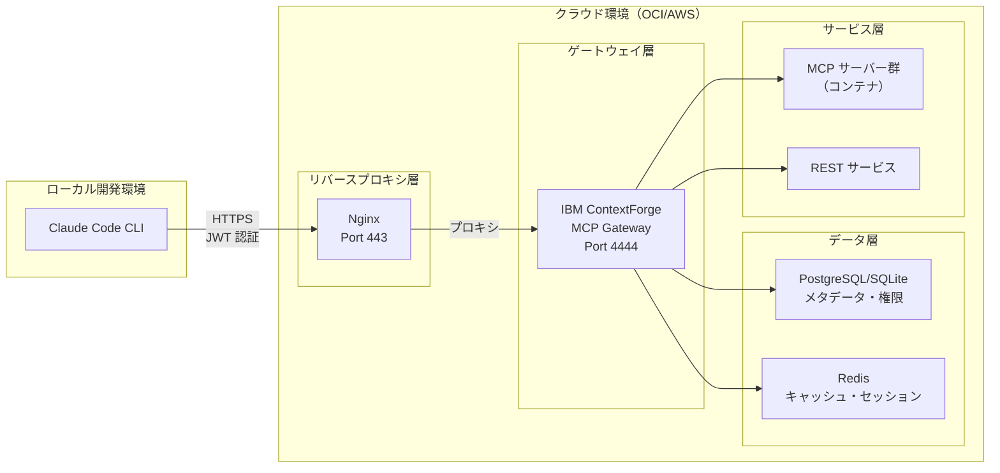

# IBM ContextForge MCP Gateway 環境構築設定一式

**エンタープライズ向け MCP（Model Context Protocol）サーバー管理ゲートウェイ**

このレポジトリは、IBMがOSSとして公開している[IBM ContextForge MCP Gateway](https://github.com/IBM/mcp-context-forge)をDockerコンテナとして起動するための設定を纏めたものになります。

またこのMCP Gatewayに登録する各MCPサーバについてもまとめて管理されるようにしています。

---

## 概要

IBM ContextForge MCP Gateway は、複数の MCP サーバーと REST サービスを統合し、AI アプリケーション向けの統一インターフェースを提供するオープンソースのゲートウェイ＆レジストリです。

### 主要機能

- **統合管理**: 複数 MCP サーバーの中央集権的レジストリと管理
- **セキュア接続**: JWT 認証、HTTPS/SSL 暗号化による安全な通信
- **マルチテナント**: チームベースの RBAC とリソース可視性制御
- **プロトコル変換**: stdio、SSE、Streamable HTTP 間の自動変換
- **高可用性**: PostgreSQL/SQLite、Redis によるデータ永続化とキャッシング
- **観測性**: OpenTelemetry による包括的なトレース・メトリクス

### 対象読者

- **開発者**: Claude Code CLI の効率的な活用を目指す方
- **システム管理者**: MCP サーバー群の運用・保守を担当する方
- **DevOps エンジニア**: セキュアなクラウド基盤の構築・自動化を推進する方

## フォルダ構成

```text
.
├── deployment/
│   └── docker-entrypoint.sh
├── docs/
├── mcp-servers/                --- 各MCP サーバーの設定ディレクトリ
├── docker-compose.yml
├── docker-network-init.sh      --- docker network 初期化スクリプト
└── Dockerfile
```

---

## クイックスタート

**5 分でデプロイ** - 最も簡単な方法（Docker + SQLite）:

```bash
# リポジトリのクローン
git clone <this-repository> mcp-gateway
cd mcp-gateway

# 環境変数ファイルの作成
cp .env.example .env

# JWT Secret Key 生成（本番環境では必須）
openssl rand -base64 64

# .env ファイルを編集
nano .env  # JWT_SECRET_KEY と管理者パスワードを変更

# ネットワーク作成（初回のみ）
docker network create mcp-servers || true

# 起動
docker compose up -d

# ヘルスチェック
curl http://localhost:4444/health
```

管理 UI: `http://localhost:4444`
デフォルト認証情報（必ず変更してください）:
- Email: `admin@example.local`
- Password: `admin123`

**詳細な手順**: [クイックスタート](#クイックスタート)

### AI エージェント側で利用時の設定方法

下記内容を、AIエージェント側の設定に追加

```json
  "mcpServers": {
    "ibm-gateway": {
      "url": "MCPGatewayのURL/sse",
      "headers": {
        "Authorization": "Bearer MCPGatewayのAPIトークン" 
      }
    }
```

- ***MCPGatewayのAPIトークン***は、MCPGatewayの管理画面にて発行した値になります。

---

## システム構成



### アーキテクチャ概要

- **Claude Code CLI**: ローカル開発環境のメインインターフェース
- **IBM ContextForge Gateway**: MCP/REST サービス統合ゲートウェイ＆レジストリ
- **PostgreSQL/SQLite**: メタデータ、ユーザー、チーム、権限の永続化
- **Redis**: キャッシング、フェデレーション、セッション管理
- **Nginx**: SSL 終端・セキュリティ・負荷分散（本番環境）
- **MCP サーバー群**: 各種機能別サーバー（コード解析、ドキュメント、テスト等）

---

## ドキュメント

### 導入・設定

- [クイックスタート](#クイックスタート) - ローカル環境でのセットアップ手順
- [環境変数リファレンス](docs/ENV.md) - 全設定項目の詳細
- [クライアント接続設定](docs/CLIENT-SETUP.md) - JetBrains AI Assistant 等との連携設定

### 設定・管理

- [ユーザー管理](docs/configuration/USER-MANAGEMENT.md) - ユーザー作成・権限管理
- [MCP サーバー設定](docs/MCP-SERVER-SETUP.md) - MCP サーバーの登録と管理
- [Nginx プロキシ設定](docs/NGINX-PROXY-SETUP.md) - HTTPS リバースプロキシの設定

---

## セキュリティ

---

## セキュリティ

### セキュリティ原則

- **最小権限の原則**: 必要最小限のアクセス権限のみ付与
- **多層防御**: 複数のセキュリティレイヤーによる保護
- **ゼロトラスト**: 内部ネットワークも含めて全て検証
- **継続的監視**: ログ監視と異常検知の実装

### ネットワークセキュリティ

- **Port 22**: SSH 管理（管理者 IP のみ・公開鍵認証）
- **Port 443**: HTTPS 統一エントリーポイント（TLS 1.3）
- **内部ポート**: 4444（ContextForge Gateway）は非公開（Nginx 経由のみ）
- **ファイアウォール**: UFW/iptables による厳格な制御

### 認証・認可

- **JWT 認証**: トークンベース認証システム
- **RBAC**: ロールベースアクセス制御
- **マルチテナント**: チーム・組織ベースの分離
- **セッション管理**: 適切なタイムアウト・無効化

---

## 外部リンク

- [IBM ContextForge GitHub](https://github.com/IBM/mcp-context-forge) - 公式 GitHub リポジトリ
- [IBM ContextForge Documentation](https://ibm.github.io/mcp-context-forge/) - 公式ドキュメント
- [IBM ContextForge on PyPI](https://pypi.org/project/mcp-contextforge-gateway/) - PyPI パッケージ
- [Claude Code Documentation](https://docs.anthropic.com/en/docs/claude-code) - Claude Code CLI
- [MCP Protocol Specification](https://spec.modelcontextprotocol.io/) - MCP 仕様書
- [Docker Hub - ContextForge](https://github.com/orgs/IBM/packages/container/package/mcp-context-forge) - コンテナイメージ

---

## ライセンス

このリポジトリは [MIT License](LICENSE) の下で公開されています。

なお、IBM ContextForge MCP Gateway 自体は Apache 2.0 ライセンスのオープンソースソフトウェアです。

---

## 免責事項

IBM ContextForge MCP Gateway は、IBM またはその関連会社からの公式サポートのないオープンソースコンポーネントです。現在ベータ版（v0.8.0）であり、マイナーバージョン間で破壊的変更が予想されます。本番環境での使用は自己責任で行ってください。

**重要事項**:
- ベータ版ソフトウェアであり、本番環境での使用は推奨されません
- セキュリティ設定を本番環境に適した値に変更してください
- 定期的なバックアップと監視体制の確立を推奨します
- 組織のセキュリティポリシーに従って適切に設定を調整してください

**対応プロトコルバージョン**: MCP Protocol `2025-03-26`

---

**最終更新**: 2025-10-19
**対象バージョン**: IBM ContextForge MCP Gateway 0.8.0
